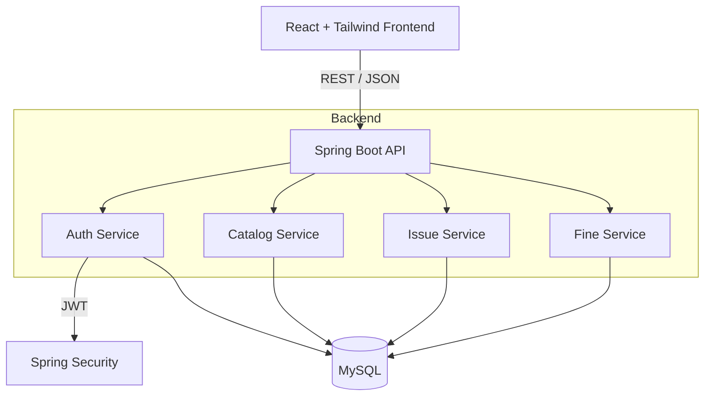

# Library Management System


A full-stack Library Management System built with Spring Boot and React. The application provides a complete solution for managing book inventory, handling user borrowing/returns, and calculating overdue fines. It includes role-based access control for students, librarians, and administrators.

## Features

- **Authentication & RBAC**: JWT-based authentication with distinct roles (`ADMIN`, `LIBRARIAN`, `STUDENT`).
- **Catalog Management**: CRUD operations for books with paginated search and filtering.
- **Borrowing System**: Tracks book issues and returns, enforcing a maximum borrowing limit (3 books per student) while managing physical inventory counts.
- **Fine Calculation**: Automatically calculates overdue fines ($1.00/day) when a book is returned late.
- **Dashboard**: Real-time statistics for total books, active borrows, overdue items, and pending fines.
- **Error Handling**: Global exception handling with standardized API responses using `@ControllerAdvice`.

## Architecture & Data Flow



## Tech Stack

**Backend**
- Java 21, Spring Boot 3.2
- Spring Security, JWT
- Spring Data JPA, Hibernate
- MySQL

**Frontend**
- React 18, Vite
- Redux Toolkit
- React Router DOM
- Tailwind CSS
- Axios

## Local Development Setup

### Requirements
- JDK 21+
- Node.js 18+
- MySQL Server 8+
- Maven

### Database Setup
1. Create the MySQL database:
   ```sql
   CREATE DATABASE library_db;
   ```
2. The schema will be initialized automatically via `backend/src/main/resources/schema.sql` on startup.
3. Update the database credentials in `backend/src/main/resources/application.yml` if needed.

### Running the Backend
```bash
cd backend
mvn clean install -DskipTests
mvn spring-boot:run
```
The API server will start on `http://localhost:8080`.

### Running the Frontend
```bash
cd frontend
npm install
npm run dev
```
The client will start on `http://localhost:5173`.

## Security Notes

Currently, the `/api/auth/register` endpoint accepts a `roleId` parameter in the request body. This allows for easy local testing by creating an admin account directly via the API:

```bash
curl -X POST http://localhost:8080/api/auth/register \
-H "Content-Type: application/json" \
-d '{"username": "admin", "email": "admin@library.com", "password": "password", "roleId": 1}'
```

In a production environment, this endpoint should be restricted to prevent mass assignment vulnerabilities. The public registration should default all users to the `STUDENT` role, and admin accounts should be created via database seeding or an internal administrative endpoint.
